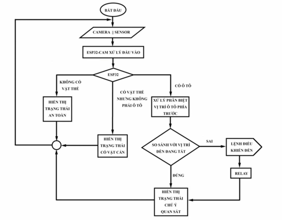
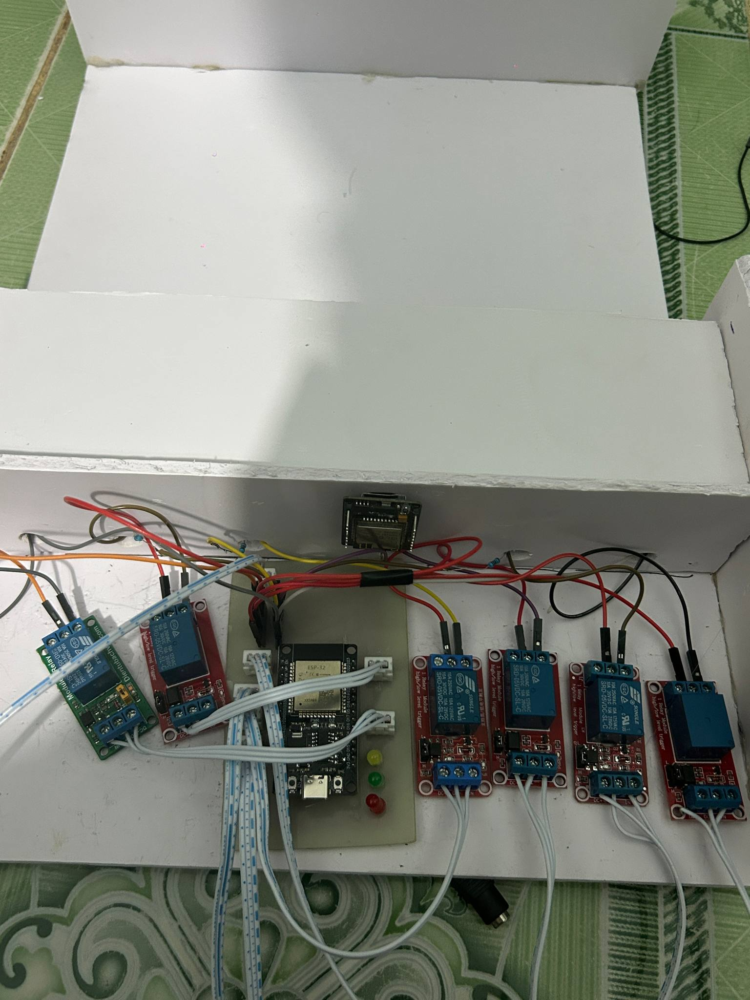
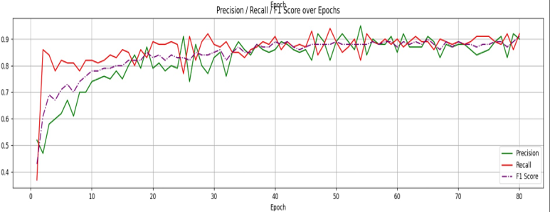

Ứng dụng UART trong kết nối ESP32-CAM và ESP32 cho hệ thống đèn pha ma trận

🧠 Giới thiệu
Dự án mô phỏng hệ thống đèn pha ma trận thông minh, lấy cảm hứng từ công nghệ ADB (Adaptive Driving Beam) trên các dòng xe Audi. Hệ thống sử dụng:

ESP32-CAM để thu nhận hình ảnh và phân tích bằng mô hình AI (Edge Impulse)

ESP32 để điều khiển các vùng sáng LED thông qua module relay, dựa trên dữ liệu nhận được từ ESP32-CAM qua UART.

🎯 Mục tiêu
Tìm hiểu và ứng dụng giao tiếp UART giữa hai vi điều khiển ESP32

Tích hợp AI vào ESP32-CAM để nhận diện phương tiện/vật cản

Điều khiển LED theo vùng, mô phỏng chức năng đèn pha thông minh

Thiết kế mạch và lập trình phần mềm hoàn chỉnh

🛠️ Công nghệ sử dụng
ESP32 & ESP32-CAM

Giao tiếp UART

Mô hình AI từ Edge Impulse

Arduino IDE

Proteus – mô phỏng và thiết kế mạch in

Module relay 4 kênh

Nguồn ngoài 5V cấp cho tải

⚙️ Chức năng hệ thống
ESP32-CAM nhận diện xe/vật cản thông qua camera và gửi tín hiệu UART:

OTO-a đến OTO-f: xe xuất hiện ở vùng a–f

vat_can: có vật thể nhưng không phải xe

an_toan: không có gì đáng chú ý

ESP32 nhận tín hiệu, xử lý và điều khiển bật/tắt từng vùng LED thông qua module relay

LED cảnh báo hiển thị theo trạng thái hệ thống (an toàn, có xe, có vật cản)

🖼️ Hình ảnh minh họa 
Sơ đồ nguyên lý

Hình ảnh thực tế mạch đã lắp

Biểu đồ đánh giá mô hình AI (Precision, Recall, F1 score)

🧪 Kết quả
Hệ thống hoạt động ổn định

Mô hình AI có độ chính xác > 80% trong nhận diện xe

Giao tiếp UART chính xác, phản hồi nhanh
